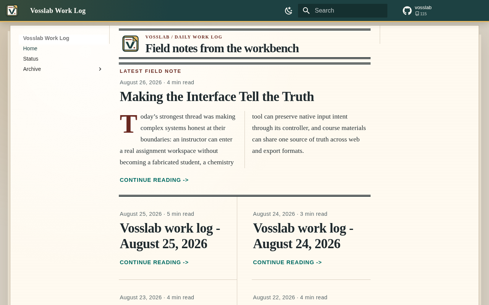

# Vosslab Daily Blog

An evidence-grounded private-LAN work-log publisher for people who want a readable daily record of
Vosslab work, with each article traceable to a validated publication for its report date.

[Read the live work log on the LAN](http://aella.local:8016/)

## A work log with receipts

This is a private reading experience, not a public feed. It turns completed Vosslab work into a
calm, newspaper-like daily log while retaining the evidence needed to inspect how each entry was
published.

- Read the current work log at [aella.local:8016](http://aella.local:8016/).
- Follow each article from its validated publication bundle to its current date-owned built release.
- Keep the last good site readable when a later bundle, validation run, or build fails.
- Publish visual and reader-navigation refinements without rewriting the imported blog.

<!-- screenshots:begin (managed by screenshot-docs) -->

<!-- screenshots:end -->

## Know the boundary

The site is the publisher half of a two-repository workflow. `vosslab-podcast` owns collection,
evidence, generation, model execution, bundle creation, and the 04:00 America/Chicago systemd
timer that directly runs `./make_blog.py --yesterday`. This repository owns the independent
validation, MkDocs source, publication records, date-owned content releases, atomic `site` pointer,
and static LAN service.

The bundle is the complete interface between those responsibilities. The current
`vosslab.daily-blog.bundle.v9` handoff carries the Stage-8 selected post, its promoted artifact
identity, the evidence and projection it cites, the canonical survivor-scoped
`publication_surface.json`, the sealed maker-activation receipt, and the exact
`publication_source_safety.v1` policy identity: SHA-256
`d50166736d79be7f7715cc0f7585fac71dfb2aecc1c631b10e01aeca2fb63c6b` of its 35-case
executable corpus. Candidate and referee deliberation remain
producer-owned run history and are not publisher inputs. This publisher does not collect GitHub
activity, run models, or schedule articles; it validates and serves complete producer output.

The immutable publication surface is the one authority for the promoted survivor set: its evidence
IDs, repository coverage, and structured selected-image paths must agree with the post, archive,
staged assets, receipt, and rendered article. That keeps a grounded post and its selected images
admissible together without broadening publication scope to unselected aggregate evidence.

The automated producer handoff is one sealed binary `--bundle-stdin` envelope, not a shared
producer pathname. The importer verifies its canonical header, bounded complete contents, and every
entry checksum before normal bundle validation. The manual `--bundle` directory command remains
available for inspection and deliberate operator imports.

The service is intentionally private to the LAN and Tailscale interface. It is beta infrastructure,
not a public-internet publishing service.

## Publish the presentation

Use this one command after changing checked-in CSS, brand assets, or reader navigation. It leaves
imported posts and the record-derived status page under importer control.

```bash
cd /home/vosslab/nsh/vosslab-daily-blog
./publish_site.sh
```

The script uses `python3.13` from `PATH`. A virtual environment is optional; activate one before
publishing when you want isolated dependencies:

```bash
python3.13 -m venv .venv
.venv/bin/python -m pip install -r pip_requirements.txt -r pip_requirements-dev.txt
source .venv/bin/activate
./publish_site.sh
```

Success ends with:

```text
Published and verified: http://aella.local:8016/
```

The command validates the source, performs a strict staged MkDocs build, writes an immutable
source-identified presentation release, atomically switches `site`, and verifies the live home and
status pages. The static server follows that pointer, so a successful publish needs no service
restart.

## Bring in an article

Normal daily publication starts in `vosslab-podcast`: its systemd timer runs
`./make_blog.py --yesterday` at 04:00 America/Chicago, creates a complete bundle, and invokes this
repository's importer with its sealed standard-input transfer. To inspect or manually import a
completed bundle, use the retained directory interface:

```bash
cd /home/vosslab/nsh/vosslab-daily-blog
source source_me.sh && python3.13 scripts/import_publication_bundle.py \
  --bundle /absolute/path/to/out/vosslab/daily_blog/YYYY-MM-DD/publication
```

An accepted import reports `status: imported`; retrying the same content for that date reports
`status: idempotent`. The scheduled producer supplies `--replace-existing` automatically when it
re-runs an occupied report date. The direct publisher command keeps the same option explicit for a
deliberate manual replacement. The importer holds one descriptor-pinned bundle view, validates its
receipts and selected post before staging, strictly builds the reader-visible page, then exchanges
each stable date-owned directory without hiding its name, switches `site`, and writes the validated
publication record last as the transaction commit.

New imports write a `vosslab.daily-blog.publication.v6` record. It binds the selected artifact,
publication-surface identity, and SHA-256 of a canonical projection of the reader-visible article
body. Both import and later presentation publication rebuild and verify that body projection and its
selected image paths, so matching title and date chrome cannot stand in for the admitted article.
Exact v5 and v3 receipts remain readable, redeployable installed history; replacing a date with a
current bundle writes a strict v6 record.

## What the publisher protects

- The date-owned bundle-v9 contract, selected-post identity, survivor-scoped publication surface,
  maker receipt, source-safety policy identity, bundle checksum, evidence, and editorial-projection
  schemas.
- Canonical publication Markdown: normal front matter, ordinary Markdown, evidence comments and
  the excerpt marker only; no active raw HTML or Markdown attribute syntax; links only to declared
  evidence assets or canonical HTTPS GitHub sources.
- Article front matter, evidence references, and provenance before rendering.
- The complete visible article body, including its ordered prose, code, and image-alt projection,
  plus every rendered article image path admitted by the publication surface, before a publication
  record or presentation release is accepted.
- A complete strict MkDocs build before any reader sees the proposed release.
- Atomic promotion, so failures continue serving the last known-good release.
- Presentation releases that are receipt-bound to the imported publication they render.

## Documentation

Start here when operating or extending the publisher:

- [docs/INSTALL.md](docs/INSTALL.md), [docs/USAGE.md](docs/USAGE.md),
  [docs/COOKBOOK.md](docs/COOKBOOK.md), [docs/TROUBLESHOOTING.md](docs/TROUBLESHOOTING.md), and
  [docs/FAQ.md](docs/FAQ.md) cover setup and operation.
- [docs/CODE_ARCHITECTURE.md](docs/CODE_ARCHITECTURE.md),
  [docs/FILE_STRUCTURE.md](docs/FILE_STRUCTURE.md), [docs/FILE_FORMATS.md](docs/FILE_FORMATS.md),
  and [docs/operations.md](docs/operations.md) define the system and its contracts.
- [docs/DEVELOPMENT.md](docs/DEVELOPMENT.md), [docs/E2E_TESTS.md](docs/E2E_TESTS.md),
  [docs/ROADMAP.md](docs/ROADMAP.md), [docs/RELATED_PROJECTS.md](docs/RELATED_PROJECTS.md), and
  [docs/CHANGELOG.md](docs/CHANGELOG.md) guide extension and project decisions.

## Status and licenses

The LAN service on port 8016 is a beta delivery path. Static serving is independent of generator
availability, so readers keep access to the last good release while producer or import work is
repaired.

The publisher code is available under [LGPL-3.0](LICENSE.LGPL-3.0). Published site content is
available under [CC BY 4.0](LICENSE.CC-BY-4.0).
