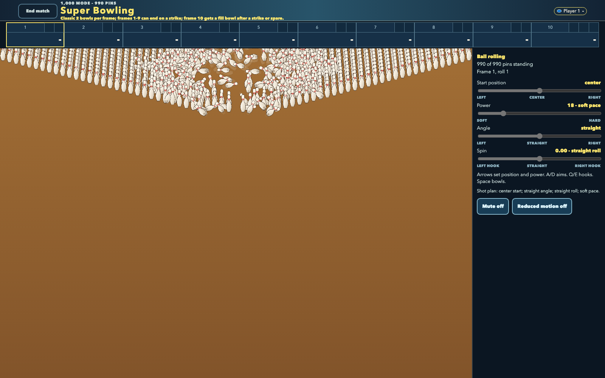
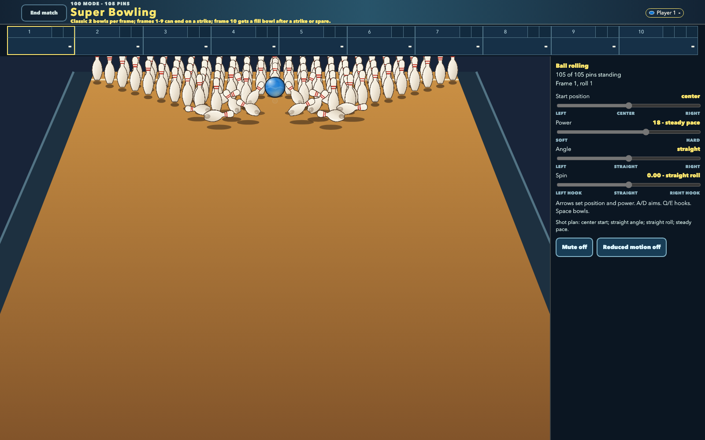

---
date:
  created: 2026-08-11
slug: cascade
---

# Making a Physics-Driven Bowling Game Feel More Alive

Today I focused on making [Super Bowling](https://github.com/vosslab/super-bowling) feel more immediate without changing what makes it fair: its physics, scoring, and player-controlled shots remain the source of truth.

<!-- more -->

## Letting the real game lead

The game is built for friends sharing one keyboard. Players shape shots down regulation-inspired lanes toward racks ranging from ordinary ten-pin bowling to an intentionally excessive 990 pins. The simulation already determined where the ball went, how pins collided, and what score resulted. My task was to make those outcomes easier-and more satisfying-to read.

I treated the camera as a guide to the action, not a separate layer that invents drama. It now follows the ball's actual path, centers on the first impact as the pins begin to fall, and then pulls back to show the final result. In dense pin fields, tiny position corrections made the viewpoint feel jittery, so I changed the live camera to move steadily forward rather than react to every small reversal in the raw samples.

That decision mattered most after impact. A close-up can look exciting, but it is not useful if it hides part of the result. I chose to frame the complete visible footprint of the fallen pins, with just enough border to make the outcome legible. The 990-pin game still gets a strong push toward the collision, but the final view shows what actually happened.

## Sound and motion from the same events

I used the game's existing collision data to drive sound as well as camera behavior. Ball hits, pin collisions, falling pins, and deck contact now produce short, bounded layers of sound based on real timing, strength, and approximate position. I added a small CC0 sound library for rolling, impacts, clatter, knocks, thumps, and hard deck contact, but the mix is still shaped by the simulated events.

That distinction is important to me. I did not want a loud arcade effect to imply a better shot than the player made. The sound should clarify the physical cascade already underway.

A few problems helped narrow the work. I initially suspected that camera math was slowing down the huge 990-pin scenes. Measurements showed otherwise: camera projection and command generation together used less than a millisecond. Browser profiling instead pointed to rendering, so I changed the artwork pipeline to rasterize the ball and pins once, then reuse those images during play. That improved the right part of the system rather than optimizing the part that merely looked suspicious.

I also fixed an audio-control error that had been muting impact transients before they reached the main mix. Once corrected, the sequence became more coherent: the roll approaches, the first contact lands, the cascade develops, and the result cue arrives afterward. For very large racks, secondary collision sounds now thin out and decay as the cascade grows instead of becoming an indistinct wall of noise.

## Keeping spectacle readable and fair

Small visual choices received the same treatment. I adjusted fallen-pin shadows so they sit at the projected ground contact behind each pin, helping angled pins feel grounded rather than suspended above the lane. In the densest modes, however, I leave those shadows out: thousands of tiny shadows cost rendering time without giving players meaningful information.

I also kept reduced motion as a complete alternate presentation, not a diminished version of the game. It uses a fixed pre-roll camera and removes decorative confetti while preserving clear strike and spare results. The goal is to retain the information and payoff without requiring the same amount of motion.

I deliberately deferred lane oil-pattern variation as well. Hidden changes in friction could make a bowling game feel arbitrary unless players can understand and respond to them. If I add that kind of variation later, it needs to be deterministic, visible, and designed as a learnable part of play-not a surprise buried in the physics.

The same concern with trustworthy presentation appeared in [Peptidyle Learning Engine](https://github.com/vosslab/peptidyle-learning-engine). I advanced a local teaching loop in which an instructor creates a course, roster, problem, and assignment, then a student can take it, receive a score, retry, and continue with fresh practice. The system keeps durable internal identities while displaying clearer human-facing labels such as `P-1-v1`.

Across both projects, I was working toward the same principle: an interface should make a system's real behavior easier to understand, not tell a more exciting story than the evidence can support.

Reconstructed from [public GitHub activity](https://api.github.com/users/vosslab/events/public?per_page=100&page=1).
It is a bounded snapshot, not complete commit history.
