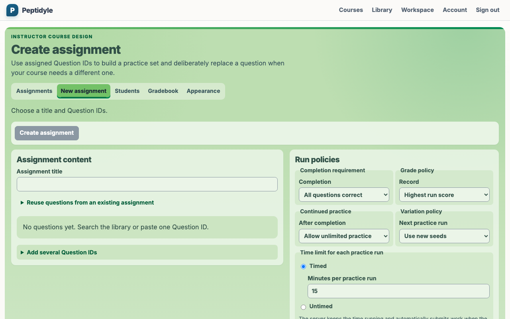
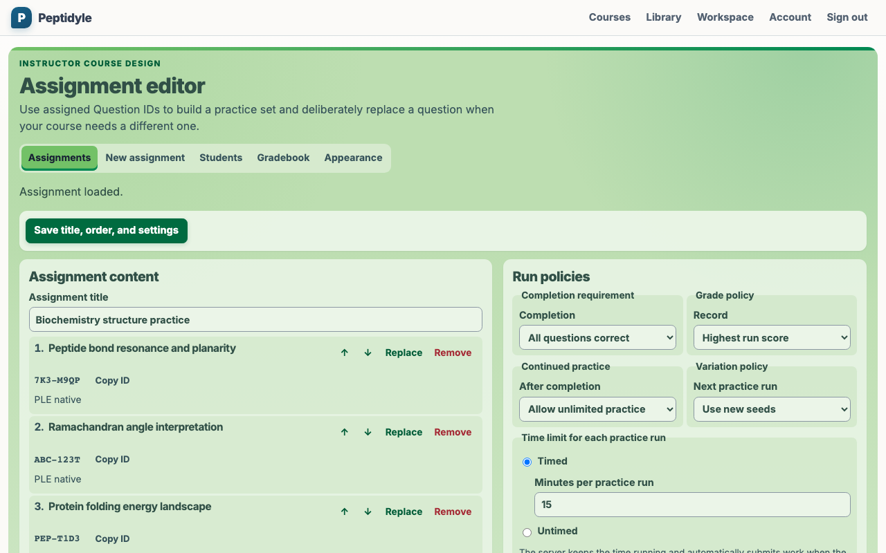

---
date:
  created: 2026-08-18
slug: work
---

# Vosslab work log - August 18, 2026

<!-- more -->

## What changed

On August 18, 2026, the public GitHub activity snapshot showed work across [vosslab/peptidyle-learning-engine](https://github.com/vosslab/peptidyle-learning-engine), [vosslab/vosslab-skills](https://github.com/vosslab/vosslab-skills), [vosslab/book-to-markdown](https://github.com/vosslab/book-to-markdown), [vosslab/battery-control](https://github.com/vosslab/battery-control), and [vosslab/brick-collection](https://github.com/vosslab/brick-collection).

In [vosslab/peptidyle-learning-engine](https://github.com/vosslab/peptidyle-learning-engine), I worked on "updated versions", "Added one authority for the committed screenshot corpus. `t... (+5 more)", and "Closed SEC-1 so catalog browse/search/detail routes are now... (+3 more)". An open platform for mastery teaching across question formats. Students retry varied problems until they can solve them consistently, then keep practicing fresh versions after completion, while grading and answer keys stay securely on the server

In [vosslab/vosslab-skills](https://github.com/vosslab/vosslab-skills), I worked on "`book-to-markdown`: moved the conversion, validation, and auditing sc...", "path correction", and "`book-to-markdown`: restored `SKILL.md` to a focused workflow shell a...". Reusable workflow skills for refactoring plans, code review, repository maintenance, and education content production. Intended for maintainers who curate skill definitions and for users who inspect or reuse SKILL.md instructions across Claude and Codex environments.

In [vosslab/book-to-markdown](https://github.com/vosslab/book-to-markdown), I worked on "Initial commit", "initial commit: reset repo to base template (python)", "Initial migration from `vosslab-skills` book-to-markdown sk... (+5 more)", and "`extract/pdf_ocr_spread_halves.py` + `pdf_extract/spread_oc... (+2 more)". Convert technical and scientific books into one clean, page-free Markdown file per title. Extraction, cleaning, validation, and auditing scripts turn PDF, EPUB, HTML, DOCX, ODT, DjVu, and text into greppable agent reference text.

In [vosslab/battery-control](https://github.com/vosslab/battery-control), I worked on "Add 135 hourly data rows through 2026-08-18 13:00". Battery arbitrage controller for ComEd real-time pricing with EP Cube and WeMo-controlled battery systems. Manages two physically separate batteries (EP Cube 20 kWh via cloud API, WeMo-controlled battery via smart plugs), making charge/discharge/hold decisions every 3 minutes based on real-time electricity prices and solar production.

In [vosslab/brick-collection](https://github.com/vosslab/brick-collection), I worked on "local edits". Python scripts for managing a personal LEGO collection: label generation, set and minifig lookups, part pricing, and BrickLink/Rebrickable/Brickset API integrations. Intended for personal use by a LEGO collector who wants printable labels and spreadsheet exports from their collection data.

## Supporting views

## Where the work stands

This entry keeps the development record readable by linking projects rather than individual source-control records.

This entry is reconstructed from the [public GitHub Events API](https://api.github.com/users/vosslab/events/public?per_page=100&page=1) for America/Chicago and retrieved 1 of at most 3 pages. It is a bounded snapshot, not complete commit history.
