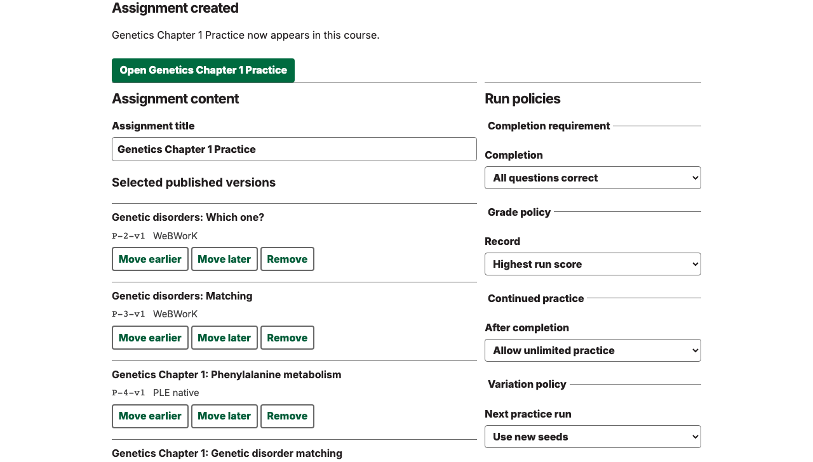

---
date:
  created: 2026-08-19
slug: work
---

# Vosslab work log - August 19, 2026

<!-- more -->

## What changed

On August 19, 2026, the public GitHub activity snapshot showed work across [vosslab/peptidyle-learning-engine](https://github.com/vosslab/peptidyle-learning-engine), [vosslab/starter-repo-template](https://github.com/vosslab/starter-repo-template), [vosslab/ferrum-chemical-forge](https://github.com/vosslab/ferrum-chemical-forge), [vosslab/track-runner-virtual-dolly-cam](https://github.com/vosslab/track-runner-virtual-dolly-cam), [vosslab/biology-problems](https://github.com/vosslab/biology-problems), and [vosslab/attack-on-cancer](https://github.com/vosslab/attack-on-cancer).

In [vosslab/peptidyle-learning-engine](https://github.com/vosslab/peptidyle-learning-engine), I worked on "Accepted WP-PROF-S3 with one pure effective-assignment-pol... (+38 more)", "intermediate commit", and "Accepted WP-PROF-S4 with one assignment-owned learner-discl... (+9 more)". An open platform for mastery teaching across question formats. Students retry varied problems until they can solve them consistently, then keep practicing fresh versions after completion, while grading and answer keys stay securely on the server

In [vosslab/starter-repo-template](https://github.com/vosslab/starter-repo-template), I worked on "add new tool", "add graph map repo", and "Updated `tools/graphify_map_repo.sh context` output to be strictly Gr...". Starter repository template for my projects. Includes style guides, AGENTS.md, agent skills, and a small set of reusable development scripts to bootstrap new repos with consistent structure and workflow.

In [vosslab/ferrum-chemical-forge](https://github.com/vosslab/ferrum-chemical-forge), I worked on "updated from template", "Moved checked CDML centimetre/scene-point conversion owner... (+17 more)", and "GRAPH report". A pre-alpha CDML chemical drawing platform for scientists and educators that combines a retained PySide6 desktop editor with a planned Rust chemistry backend for durable document ownership.

In [vosslab/track-runner-virtual-dolly-cam](https://github.com/vosslab/track-runner-virtual-dolly-cam), I worked on "updated from template repo". a Python tool that tracks a runner in track meet video and produces a cropped, stabilized "virtual dolly camera" output. Users place seed annotations on key frames, and the solver propagates tracking between seeds to produce a smooth cropped video that follows the athlete.

In [vosslab/biology-problems](https://github.com/vosslab/biology-problems), I worked on "Replaced removed `numpy.chararray` uses in the shared phylo... (+1 more)". Python scripts that generate biochemistry, genetics, molecular biology, and related homework/quiz items for instructors and course staff. Inputs live in data/ and images/, and generators emit outputs such as bbq-*.txt, qti*.zip, and selftest-*.html (ignored by git).

In [vosslab/attack-on-cancer](https://github.com/vosslab/attack-on-cancer), I worked on "Initial commit", "initial commit: reset repo to base template (typescript)", "Revise deploy-pages workflow for GitHub Actions", "Documented the Attack on Cancer v1 game experience, contro... (+10 more)", "Refreshed the README landing page with a newcomer quick start, projec...", "Added a beating Wave 15 Tumor Mass that sheds Basic cells a... (+3 more)", "Simplified Tumor Mass motion to one readable double heartbeat and an ...", and "Added the Cluster Corridor second scene: a multi-tumor sour... (+1 more)". A bright browser tower-defense game for students and curious players who want to protect a Skin Tissue route with readable cancer treatments rather than memorize biology facts.

In [vosslab/biology-problems-website](https://github.com/vosslab/biology-problems-website), I worked on "remove downloads", "Switched the website's Blackboard Ultra download from the Q... (+4 more)", "remove misclassified topics", "start fresh", "remove dna profiling", and "generated bbq text files". Free, open biology problem sets that help students practice and give educators ready-to-use questions for courses, homework, quizzes, and learning-management systems.

## Supporting views

## Where the work stands

This entry keeps the development record readable by linking projects rather than individual source-control records.

This entry is reconstructed from the [public GitHub Events API](https://api.github.com/users/vosslab/events/public?per_page=100&page=1) for America/Chicago and retrieved 1 of at most 3 pages. It is a bounded snapshot, not complete commit history.
