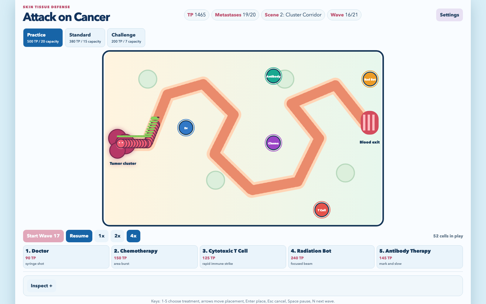
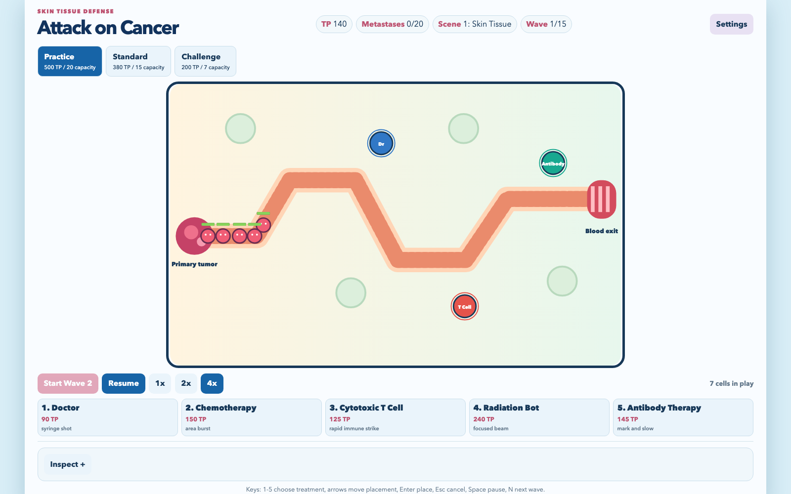

---
date:
  created: 2026-08-21
slug: work
---

# Vosslab work log - August 21, 2026

<!-- more -->

## What changed

On August 21, 2026, the public GitHub activity snapshot showed work across [vosslab/peptidyle-learning-engine](https://github.com/vosslab/peptidyle-learning-engine), [vosslab/starter-repo-template](https://github.com/vosslab/starter-repo-template), [vosslab/track-runner-virtual-dolly-cam](https://github.com/vosslab/track-runner-virtual-dolly-cam), [vosslab/battery-control](https://github.com/vosslab/battery-control), [vosslab/ferrum-chemical-forge](https://github.com/vosslab/ferrum-chemical-forge), and [vosslab/attack-on-cancer](https://github.com/vosslab/attack-on-cancer).

In [vosslab/peptidyle-learning-engine](https://github.com/vosslab/peptidyle-learning-engine), I worked on "Moved the live-demo selector identities and generation-boun... (+9 more)", "minor updates", and "Accepted `WP-PROF-BS1-H0`: a typed shared `live_demo` brow... (+16 more)". An open platform for mastery teaching across question formats. Students retry varied problems until they can solve them consistently, then keep practicing fresh versions after completion, while grading and answer keys stay securely on the server

In [vosslab/starter-repo-template](https://github.com/vosslab/starter-repo-template), I worked on "graphify: pip install and ignore", "Added `/graphify-out/` to `templates/gitignore.universal`, ... (+2 more)", "more to remove", and "Added a vendored-file header to every propagated `test_*.py` file. It...". Starter repository template for my projects. Includes style guides, AGENTS.md, agent skills, and a small set of reusable development scripts to bootstrap new repos with consistent structure and workflow.

In [vosslab/track-runner-virtual-dolly-cam](https://github.com/vosslab/track-runner-virtual-dolly-cam), I worked on "remove all images", "remove images", "removed old blob walk v2; added to main code", "removed images", "more deleted files", "removed", "no fixtures, per docs/PYTEST_STYLE.md", "removed files", "fix old markdown links", "from upstream", "upstream files", "from upstream", "removed", "Fast pytest now avoids operational and GUI-lifecycle check... (+69 more)", "Fixup-plan close-out uses grounded repository evidence", and "cleaner look". a Python tool that tracks a runner in track meet video and produces a cropped, stabilized "virtual dolly camera" output. Users place seed annotations on key frames, and the solver propagates tracking between seeds to produce a smooth cropped video that follows the athlete.

In [vosslab/battery-control](https://github.com/vosslab/battery-control), I worked on "Add 11 hourly data rows through 2026-08-21 07:00", "Add 3 hourly data rows through 2026-08-21 10:00", and "Add 3 hourly data rows through 2026-08-21 13:00". Battery arbitrage controller for ComEd real-time pricing with EP Cube and WeMo-controlled battery systems. Manages two physically separate batteries (EP Cube 20 kWh via cloud API, WeMo-controlled battery via smart plugs), making charge/discharge/hold decisions every 3 minutes based on real-time electricity prices and solar production.

In [vosslab/ferrum-chemical-forge](https://github.com/vosslab/ferrum-chemical-forge), I worked on "Corrected the presentation-creation gesture PyO3 preview b... (+28 more)", "Validated the copied CLI engine bundle against its canonic... (+20 more)", "Made the default developer build publish the native and Qt... (+18 more)", "wheel builder code", and "wheel builder code #2". A pre-alpha CDML chemical drawing platform for scientists and educators that combines a retained PySide6 desktop editor with a planned Rust chemistry backend for durable document ownership.

In [vosslab/attack-on-cancer](https://github.com/vosslab/attack-on-cancer), I worked on "Added three current gameplay captures under `docs/screensh... (+11 more)". A bright browser tower-defense game for students and curious players who want to protect a Skin Tissue route with readable cancer treatments rather than memorize biology facts.

## Supporting views

## Where the work stands

This entry keeps the development record readable by linking projects rather than individual source-control records.

This entry is reconstructed from the [public GitHub Events API](https://api.github.com/users/vosslab/events/public?per_page=100&page=1) for America/Chicago and retrieved 1 of at most 3 pages. It is a bounded snapshot, not complete commit history.
