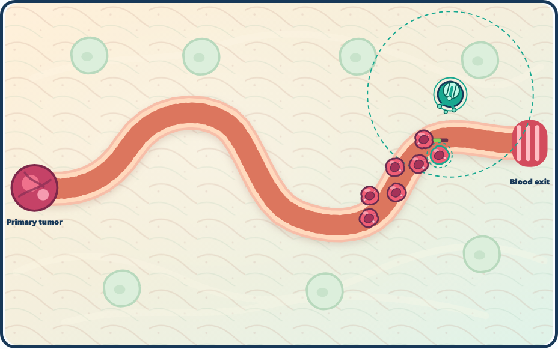
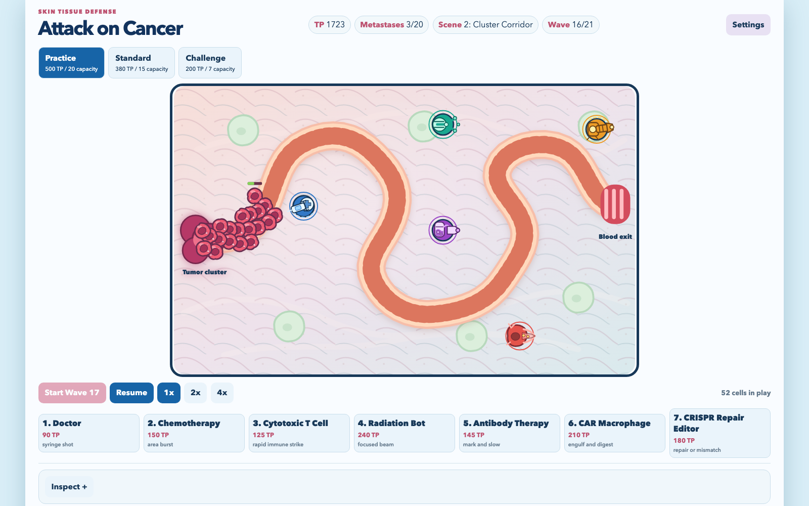
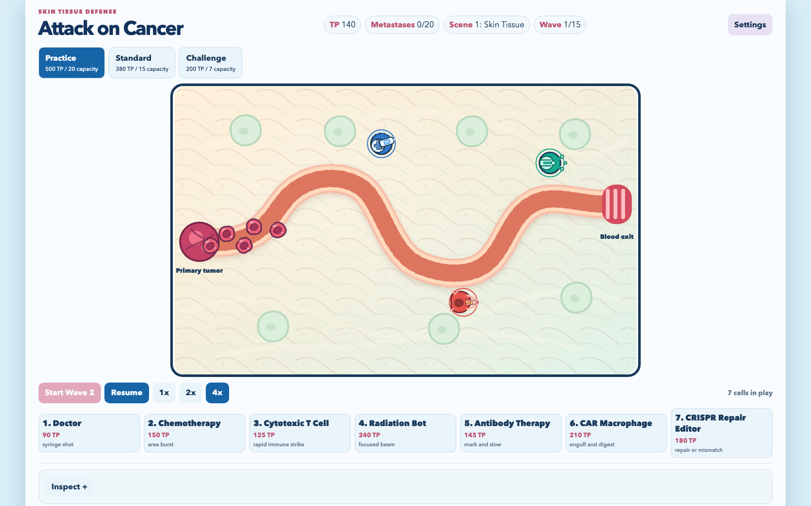

---
date:
  created: 2026-08-24
slug: work
---

# Vosslab work log - August 24, 2026

<!-- more -->

## What changed

On August 24, 2026, the public GitHub activity snapshot showed work across [vosslab/vosslab-skills](https://github.com/vosslab/vosslab-skills), [vosslab/ferrum-chemical-forge](https://github.com/vosslab/ferrum-chemical-forge), [vosslab/peptidyle-learning-engine](https://github.com/vosslab/peptidyle-learning-engine), [vosslab/starter-repo-template](https://github.com/vosslab/starter-repo-template), [vosslab/attack-on-cancer](https://github.com/vosslab/attack-on-cancer), and [vosslab/virtual-lab-protocol-simulation](https://github.com/vosslab/virtual-lab-protocol-simulation).

In [vosslab/vosslab-skills](https://github.com/vosslab/vosslab-skills), I worked on "Added `svg-creator-expert`, a book-backed expert skill tha... (+14 more)". Reusable workflow skills for refactoring plans, code review, repository maintenance, and education content production. Intended for maintainers who curate skill definitions and for users who inspect or reuse SKILL.md instructions across Claude and Codex environments.

In [vosslab/ferrum-chemical-forge](https://github.com/vosslab/ferrum-chemical-forge), I worked on "Added the M4 atom-oxidation V1 evidence receipt. The bound... (+51 more)" and "Registered `document.compact-group.materialize.v1` in the ... (+35 more)". A pre-alpha CDML chemical drawing platform for scientists and educators that combines a retained PySide6 desktop editor with a planned Rust chemistry backend for durable document ownership.

In [vosslab/peptidyle-learning-engine](https://github.com/vosslab/peptidyle-learning-engine), I worked on "Restored whole-course grade-settings mutation after assign... (+17 more)", "remove rehearsal", "Selected the live demo as PLE's single product and acceptance path an...", "Accepted WP-PROF-T5 item pools on the canonical live-demo p... (+3 more)", and "updated plans". An open platform for mastery teaching across question formats. Students retry varied problems until they can solve them consistently, then keep practicing fresh versions after completion, while grading and answer keys stay securely on the server

In [vosslab/starter-repo-template](https://github.com/vosslab/starter-repo-template), I worked on "Added prominent step labels to `tools/graphify_map_repo.sh` before de...", "Replaced `tools/graphify_map_repo.sh` with the executable P... (+8 more)", "more to ignore", "Restored per-build `graphifyy\[ollama,sql,terraform\]` upgrad... (+3 more)", "Preserved reusable community labels on actual updates with ... (+3 more)", "ignore more", and "Made the Graphify pip upgrade quiet and disabled pip's alr... (+14 more)". Starter repository template for my projects. Includes style guides, AGENTS.md, agent skills, and a small set of reusable development scripts to bootstrap new repos with consistent structure and workflow.

In [vosslab/attack-on-cancer](https://github.com/vosslab/attack-on-cancer), I worked on "Added structured inline SVG cancer-cell actors with distin... (+16 more)", "Added a temporary browser contact sheet built from the rea... (+31 more)", and "Hardened SVG reference validation so a valid local `url(#id... (+3 more)". A bright browser tower-defense game for students and curious players who want to protect a Skin Tissue route with readable cancer treatments rather than memorize biology facts.

In [vosslab/virtual-lab-protocol-simulation](https://github.com/vosslab/virtual-lab-protocol-simulation), I worked on "The equipment SVG sweep adopted the de-shadowed Servier vis... (+7 more)". An interactive browser-based simulation game that teaches cell culture laboratory techniques. Players practice aspirating old media, feeding cells with fresh media, drug treatment pipetting, and microscope observation in a guided workflow.

## Supporting views

## Where the work stands

This entry keeps the development record readable by linking projects rather than individual source-control records.

This entry is reconstructed from the [public GitHub Events API](https://api.github.com/users/vosslab/events/public?per_page=100&page=1) for America/Chicago and retrieved 1 of at most 3 pages. It is a bounded snapshot, not complete commit history.
