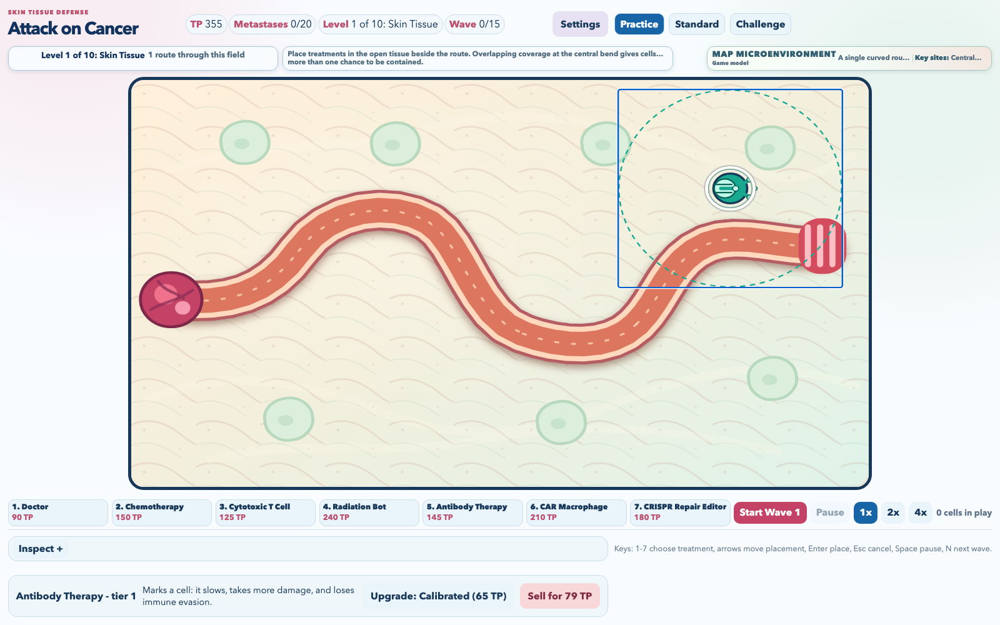
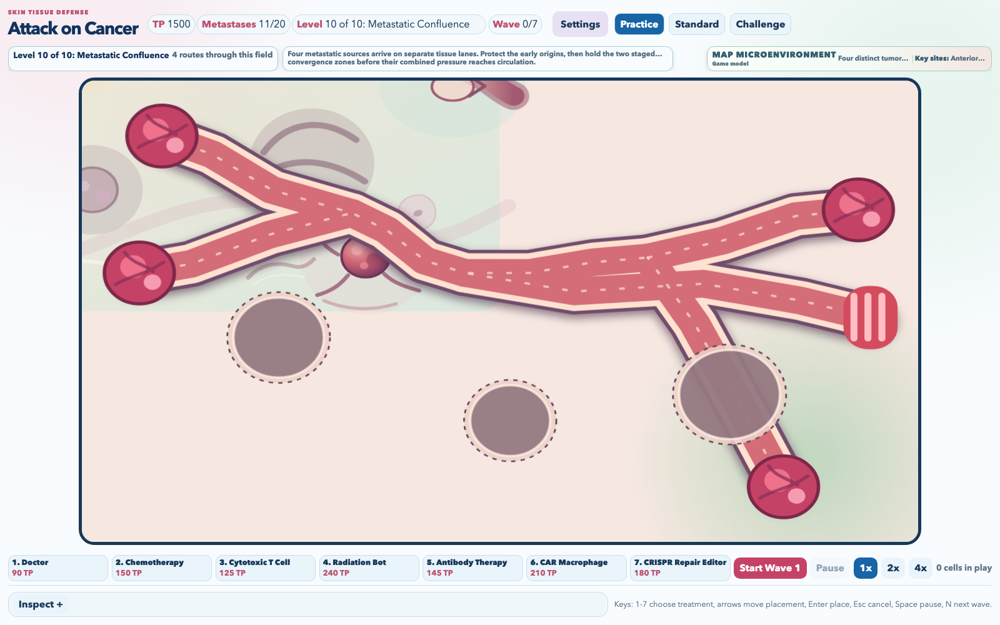

---
date:
  created: 2026-08-25
slug: work
---

# Vosslab work log - August 25, 2026

<!-- more -->

## What changed

On August 25, 2026, the public GitHub activity snapshot showed work across [vosslab/battery-control](https://github.com/vosslab/battery-control), [vosslab/virtual-lab-protocol-simulation](https://github.com/vosslab/virtual-lab-protocol-simulation), [vosslab/attack-on-cancer](https://github.com/vosslab/attack-on-cancer), [vosslab/ferrum-chemical-forge](https://github.com/vosslab/ferrum-chemical-forge), [vosslab/peptidyle-learning-engine](https://github.com/vosslab/peptidyle-learning-engine), [vosslab/starter-repo-template](https://github.com/vosslab/starter-repo-template), [vosslab/syllabus](https://github.com/vosslab/syllabus), [vosslab/screenshot-ai-renamer-macos](https://github.com/vosslab/screenshot-ai-renamer-macos), [vosslab/biology-problems-website](https://github.com/vosslab/biology-problems-website), and [vosslab/biology-problems](https://github.com/vosslab/biology-problems).

In [vosslab/battery-control](https://github.com/vosslab/battery-control), I worked on "Add 56 hourly data rows through 2026-08-25 06:00". Battery arbitrage controller for ComEd real-time pricing with EP Cube and WeMo-controlled battery systems. Manages two physically separate batteries (EP Cube 20 kWh via cloud API, WeMo-controlled battery via smart plugs), making charge/discharge/hold decisions every 3 minutes based on real-time electricity prices and solar production.

In [vosslab/virtual-lab-protocol-simulation](https://github.com/vosslab/virtual-lab-protocol-simulation), I worked on "from repo template", "Human review rejected the flattened water-bath redraw. Both... (+2 more)", "update from upstream", "these promote legacy content", "remove", "remove legacy tests", and "Reorganized the SVG ingestion normalizer as the focused `to... (+6 more)". An interactive browser-based simulation game that teaches cell culture laboratory techniques. Players practice aspirating old media, feeding cells with fresh media, drug treatment pipetting, and microscope observation in a guided workflow.

In [vosslab/attack-on-cancer](https://github.com/vosslab/attack-on-cancer), I worked on "Added an active ten-level branching-campaign plan with type... (+1 more)", "updated from upstream", "Replaced the two-scene game model with a validated, typed ... (+44 more)", and "Added a crisp, editable SVG favicon that combines the game's cancer-c...". A bright browser tower-defense game for students and curious players who want to protect a Skin Tissue route with readable cancer treatments rather than memorize biology facts.

In [vosslab/ferrum-chemical-forge](https://github.com/vosslab/ferrum-chemical-forge), I worked on "Added typed live-atom revision and digest fence translatio... (+31 more)", "vendored", "Stabilized the public CLI verb E2E around Ferrum's durable... (+15 more)", "Completed the durable `document_object_id` migration for pr... (+4 more)", "minor", and "new file". A pre-alpha CDML chemical drawing platform for scientists and educators that combines a retained PySide6 desktop editor with a planned Rust chemistry backend for durable document ownership.

In [vosslab/peptidyle-learning-engine](https://github.com/vosslab/peptidyle-learning-engine), I worked on "Accepted WP-PROF-D1 question discovery on the canonical liv... (+3 more)", "Accepted WP-PROF-D2 live problem curation and advanced the ... (+3 more)", "updated", "Established the `WP-PROF-B2` domain foundation for explicit... (+7 more)", and "updates". An open platform for mastery teaching across question formats. Students retry varied problems until they can solve them consistently, then keep practicing fresh versions after completion, while grading and answer keys stay securely on the server

In [vosslab/starter-repo-template](https://github.com/vosslab/starter-repo-template), I worked on "`devel/rotate_changelog.py` now begins automatic rotation o... (+4 more)". Starter repository template for my projects. Includes style guides, AGENTS.md, agent skills, and a small set of reusable development scripts to bootstrap new repos with consistent structure and workflow.

In [vosslab/syllabus](https://github.com/vosslab/syllabus), I worked on "Initial commit", "first commit", "remove content", "one more", "Added term-first Fall 2026 pages for BIOL 318/418, BIOL 35... (+61 more)", "Update GitHub Actions workflow for deployment", "Replaced the thin repository README with a content-first landing page...", "Upgrade Python setup action to version 7", "nonthign", "Simplify export step in deploy-pages workflow", "Changed Pages deployment to run after every successful `mai... (+1 more)", "Strengthened the complete PDF heading hierarchy so each lin... (+1 more)", "Added restricted Markdown fragment embedding so instructor... (+40 more)", "updates", "Removed the parallel Markdown and manifest template tree; ... (+12 more)", "Documented the complete source-to-output boundary: active-t... (+1 more)", and "Replaced the generic AI-use paragraph with one shared Fall 2026 honor...". An accessibility-focused publishing system that turns separately maintained course pages, policies, and resources into a navigable student website plus complete PDF and DOCX syllabi for departmental archives.

In [vosslab/screenshot-ai-renamer-macos](https://github.com/vosslab/screenshot-ai-renamer-macos), I worked on "updates from template repo", "Add a configurable filename-model provider layer backed by... (+18 more)", and "Keep Ollama model identity in `DEFAULT_FILENAME_MODEL` as ... (+11 more)". A Python tool that extracts on-screen text, generates two captions, and renames macOS screenshots with concise, context-aware filenames. Filename generation runs on-device with Apple Foundation Models.

In [vosslab/biology-problems-website](https://github.com/vosslab/biology-problems-website), I worked on "Added run_web_server.sh as the repository-aware local previ... (+7 more)" and "Extended the Atkinson text font through the daily puzzle roots and em...". Free, open biology problem sets that help students practice and give educators ready-to-use questions for courses, homework, quizzes, and learning-management systems.

In [vosslab/biology-problems](https://github.com/vosslab/biology-problems), I worked on "Removed named Arial font overrides from generated questions... (+1 more)". Python scripts that generate biochemistry, genetics, molecular biology, and related homework/quiz items for instructors and course staff. Inputs live in data/ and images/, and generators emit outputs such as bbq-*.txt, qti*.zip, and selftest-*.html (ignored by git).

In [vosslab/qti-package-maker](https://github.com/vosslab/qti-package-maker), I worked on "Isolated HTML self-test controls by item CRC, made MULTI_FI... (+1 more)". A Python package and CLI that converts Blackboard Question Upload (BBQ) text files into QTI packages and other formats (Canvas, Blackboard, human-readable text, HTML self-tests). For instructors and developers moving assessments across LMSs.

## Supporting views

## Where the work stands

This entry keeps the development record readable by linking projects rather than individual source-control records.

This entry is reconstructed from the [public GitHub Events API](https://api.github.com/users/vosslab/events/public?per_page=100&page=1) for America/Chicago and retrieved 1 of at most 3 pages. It is a bounded snapshot, not complete commit history.
