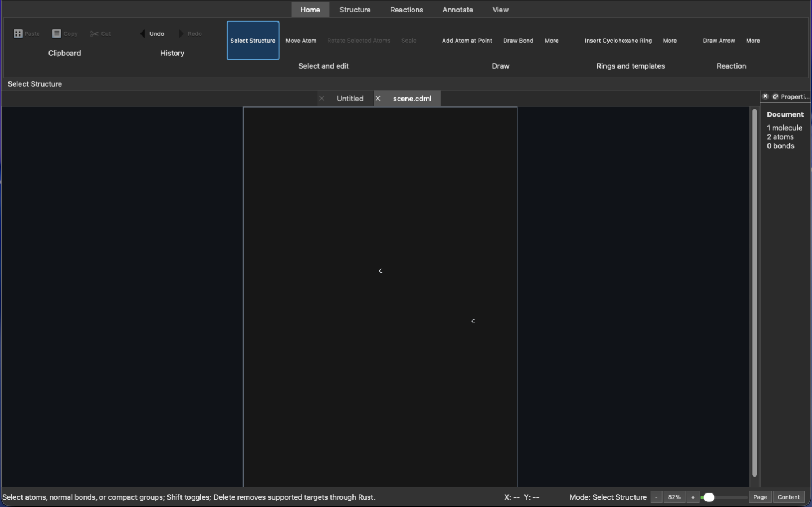

# The Reason a Retry Is Allowed

Today I kept finding the same question in systems that look unrelated: when something resumes after interruption, what gives it the right to continue instead of merely producing another plausible-looking result? <!-- evidence: ev-5a3568feb275741b, ev-c8abcf3e41aac3d8 -->

<!-- more -->

## Publication needs a memory

<!-- evidence: ev-5a3568feb275741b, ev-c8abcf3e41aac3d8 -->

Most of my attention went to the daily publication path, split between
[vosslab/vosslab-podcast](https://github.com/vosslab/vosslab-podcast) and
[vosslab/vosslab-daily-blog](https://github.com/vosslab/vosslab-daily-blog).
It is tempting to describe that path as "generate a post and publish it," because on
a good day that is what the reader sees. But that description leaves out every
interesting failure: evidence collection can finish while authoring fails, a referee
can reject an otherwise valid draft, a bundle can be formed but not delivered, or a
delivery can be interrupted after some durable state has changed.

I rebuilt the producer around named phases and artifacts that can earn reuse. Collected
activity, evidence, valid author output, validation results, final referee decisions,
and a fully revalidated immutable bundle can be resumed only after hash verification.
A provisional or failed editorial result remains retryable rather than acquiring
authority just because it exists on disk. Even when the upstream path is unchanged,
the importer is still called so it can establish external idempotency for itself.
That distinction made the workflow feel much less like a cache and much more like an
account of what actually happened.

The provenance work was particularly satisfying. Evidence schema v2 records an exact
revision range for each attributed commit-to-parent edge and preserves branch-tip
snapshots. A productive day is rarely a neat line of commits on one branch. I did not
want the software that writes about a day of work to quietly turn non-linear history
into a cleaner story than the repositories can support.

On the receiving side, a bundle is now a connected publication claim rather than a
zip-shaped collection of files. The importer checks schema, hashes, authority,
provenance, allowable asset paths, candidates, front matter, paragraph evidence, and
the anonymous-referee mapping that connects the selected post to the candidate that
was actually judged. A document that looks publishable is not necessarily one that is
authorized to become public state.

The failure tests made the design feel concrete. They compare the full durable
surface--source, records, archives, releases, staging, and served pointer--before and
after a failed transaction. Either the handoff completes, or the previous world is
still there. Focused importer coverage passed 11 cases, the producer suite passed
1,035 tests, and the real MkDocs source completed a strict build. Known historical
link failures remain visible rather than being disguised as a clean result. <!-- evidence: ev-5a3568feb275741b, ev-c8abcf3e41aac3d8 -->

## Accepting work means owning recovery

<!-- evidence: ev-c5a036054d804236 -->

The same idea became more consequential in
[vosslab/peptidyle-learning-engine](https://github.com/vosslab/peptidyle-learning-engine).
Automated grading can appear to be a simple line from learner response to score, but
the review found a gap beneath that line: grading could begin before an accepted
response had a durable owner responsible for retry after interruption.

The G1 design now gives that obligation a home. One immutable, server-private
`submission` becomes authoritative before grading begins. Execution state, evaluation,
Instructor operations, and append-only receipts are separate projections with their
own narrower jobs. The system reuses established score recalculation and publication
authorities rather than creating another score-changing path that later has to be
reconciled.

I like the privacy consequence of that design. Recovery needs a durable owner, but
that does not make every operational component entitled to learner answers. Separate
API and worker identities, answer-free metadata parents, private response storage,
retention fences, and row-level security turn privacy into a lifecycle property
instead of a redaction step at the end.

There is still a real proof obligation here. Learner acceptance must synchronously
claim the exact job through the same leased handler that recovery uses, and completed
PostgreSQL reads need a least-privilege proof tying their data back to the
worker-owned evaluation source and digest. Those are not finishing touches. They are
the reason the system can claim that accepted work will remain accountable when the
easy path fails. <!-- evidence: ev-c5a036054d804236 -->

## The boundary can be visual too

<!-- evidence: ev-031d2245a7ddd3d6, ev-6ef451897f15b69c, ev-a3cd290f6d2535f6 -->

In [vosslab/ferrum-chemical-forge](https://github.com/vosslab/ferrum-chemical-forge),
the same question showed up in a much friendlier form: what does a color know about
itself as it travels through the application?

A chemical drawing moves among a retained Qt scene, temporary interaction previews,
Python bindings, Rust document and render logic, and headless SVG, PDF, and PNG
export. Flattening every paint value to RGB early can still produce reasonable pixels,
but it loses why that color exists. Was it authored directly? Does it express a
document role? Is it an element role validated by the chemical model?

`RenderPaintV3` preserves those distinctions as frozen tagged values. Rust owns export
interpretation for durable SVG, PDF, and PNG output; PyO3 exposes read-only paint
facts; Qt owns the active display palette. That leaves room for a theme to change
how the editor looks without accidentally becoming the authority for what an exported
chemical figure means.

What I enjoyed was discovering that this was not primarily a palette project. It was
lifecycle work again. Retained Qt roots and temporary interaction previews have to
refresh their material without rebuilding Rust-issued geometry, identifiers,
revisions, sessions, or gestures. Twenty-eight approved document-display tests passed,
but eight of thirteen GUI-capture frames were rejected in human review. The next
useful step is not another architectural claim. It is a new capture and a careful look
at the actual desktop application. <!-- evidence: ev-6ef451897f15b69c -->

## Shared guidance without a takeover

<!-- evidence: ev-1202c31302dc0a9e -->

I found a smaller version of the same ownership problem in
[vosslab/starter-repo-template](https://github.com/vosslab/starter-repo-template).
Shared repository guidance tends to force an uncomfortable choice: overwrite a
consumer-owned file and risk deleting local work, or seed it once and let the common
policy drift.

The new `HEADER` propagation bucket gives mixed-ownership documents an explicit
contract. An absent consumer file can be seeded whole. Later synchronization refreshes
only a marked vendored region, leaving local material outside that boundary in place.
Unpaired, duplicated, or reversed markers produce an error and leave the file alone.
The synchronizer is deliberately willing to act when ownership is clear and
deliberately unwilling to guess when it is not.

That restraint is the part I want to carry forward. A useful automation is not one
that changes the most files. It is one that can identify the part it owns, preserve
the part it does not, and refuse a change before uncertainty becomes silent damage.
<!-- evidence: ev-1202c31302dc0a9e -->

The day left me more convinced that recovery is not simply trying again. A retry is
a claim about history: this earlier work is still intact, still applicable, and still
authorized to continue. Building systems that can make that claim honestly is slower
than making them look successful once. It is also much more satisfying.

<!-- evidence: ev-031d2245a7ddd3d6, ev-1202c31302dc0a9e, ev-5a3568feb275741b, ev-6ef451897f15b69c, ev-a3cd290f6d2535f6, ev-c5a036054d804236, ev-c8abcf3e41aac3d8 -->

## Project coverage

- [vosslab/syllabus](https://github.com/vosslab/syllabus) — 7 commits
- [vosslab/peptidyle-learning-engine](https://github.com/vosslab/peptidyle-learning-engine) — 5 commits
- [vosslab/cancer-clicker-ng](https://github.com/vosslab/cancer-clicker-ng) — 4 commits
- [vosslab/starter-repo-template](https://github.com/vosslab/starter-repo-template) — 4 commits
- [vosslab/ferrum-chemical-forge](https://github.com/vosslab/ferrum-chemical-forge) — 3 commits
- [vosslab/screenshot-ai-renamer-macos](https://github.com/vosslab/screenshot-ai-renamer-macos) — 3 commits
- [vosslab/battery-control](https://github.com/vosslab/battery-control) — 2 commits
- [vosslab/biology-problems](https://github.com/vosslab/biology-problems) — 2 commits
- [vosslab/cancer-clicker](https://github.com/vosslab/cancer-clicker) — 1 commit
- [vosslab/protein-image-grader](https://github.com/vosslab/protein-image-grader) — 1 commit
- [vosslab/virtual-lab-protocol-simulation](https://github.com/vosslab/virtual-lab-protocol-simulation) — 1 commit
- [vosslab/vosslab-daily-blog](https://github.com/vosslab/vosslab-daily-blog) — 1 commit
- [vosslab/vosslab-podcast](https://github.com/vosslab/vosslab-podcast) — 1 commit
