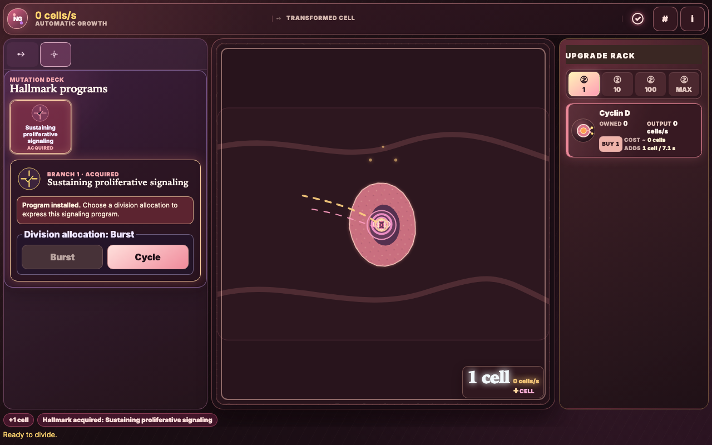

# Proof That Survives the Room

Today I found myself caring less about whether a system could produce a reassuring result and more about whether it could preserve the reason to trust that result after the people, processes, and external services around it had changed.  
<!-- evidence: ev-0501f010e82d7544, ev-d2ee11c4f8152fed -->

<!-- more -->

The clearest version of that work happened in [vosslab/vosslab-podcast](https://github.com/vosslab/vosslab-podcast), which owns the machinery that turns a day of software making into something publishable. I closed a maker-voice repair around a small but consequential timing problem: validation had to use the same descriptor state that the later workflow would consume. Checking a mutable description and then acting on whatever it had become later is a quiet way for a workflow to make promises it cannot actually keep.

The repair is pleasantly reductive. I stopped treating human approval, an available live model, or arbitrary extra tests as prerequisites for a completed result. Sealed fixtures now carry the final acceptance burden. A live route can still teach me something useful about the world outside the test harness, but it cannot revoke a result already established by deterministic, retained evidence.

That is not an argument against observation. It is an argument for knowing which kind of observation is allowed to decide whether work is finished.

## The difference between a check and a record

<!-- evidence: ev-0501f010e82d7544 -->

I enjoyed the scope of the acceptance run because it made the idea concrete instead of philosophical. The producer suite passed 2,450 tests on Python 3.12.13. The publisher suite passed 1,362 on Python 3.13.5, with another 310 publisher-hygiene tests. The path also covered a strict disposable MkDocs build, publication and schedule end-to-end checks, a twelve-case crash exercise, four independent audits, and matching approved prompt hashes.

None of those numbers is interesting on its own. What interested me was that the evidence survives the particular moment in which it was made. Someone can rerun the fixture-backed path without needing a favorable model response or a person available to bless it. The workflow can distinguish “this external route was unavailable” from “the artifact has not been proven.”

That is a better kind of automation. It does not merely replace a person with a script; it leaves behind enough proof that a later person can understand why the script was allowed to proceed.

The unresolved part is still useful. Live routes can expose failure modes that sealed fixtures do not contain, especially at the boundary with a changing model or service. I want those observations to stay visible and actionable without allowing their variability to turn deterministic completion back into a waiting room.

## A Gradebook should not have two memories

<!-- evidence: ev-0183638b63e63b98, ev-d2ee11c4f8152fed -->

The same instinct showed up at a different scale in [vosslab/peptidyle-learning-engine](https://github.com/vosslab/peptidyle-learning-engine). Its automated-only grading closure retired parallel manual-grading persistence in favor of one deterministic evaluation owner, immutable completion evidence, bounded retry and recalculation, calculated Gradebook totals, and roster score export.

I like this change because it refuses an attractive but expensive compromise. When two durable records can both claim to mean “this is the grade,” the system eventually has to reconcile its own interpretations. That reconciliation can become the real product, hiding uncertainty behind a more elaborate repair process.

The cleaner design is to retain the completed-work evidence, let one defined evaluation path interpret it, and derive reported totals from that record. Recalculation still exists, but as a bounded recovery operation rather than an informal second authority.

The surrounding contract work made that distinction sharper. The curriculum-adoption Memory layer now retains the original request source, parsed projection, protocol version, SHA-256 digest, target information, and replay or conflict evidence. An idempotent replay is recognizable; an occupied target is refused before state changes. I keep coming back to the phrase “retain the cause, not merely the outcome.” It is a good test for whether a consequential state transition will be comprehensible later.

There is an important limit on the claim. Much of the curriculum-adoption work is explicitly preparatory: it does not yet claim PostgreSQL, RLS, runtime-service, browser, or release completion. That restraint is part of why I trust the changelog. A system that names its unfinished boundary is easier to extend safely than one that calls every local green check “done.”

## Making the next click earn its place

<!-- evidence: ev-29dd707a60332a35, ev-48fae9772b455b41, ev-739e5c2794321f59 -->

Meanwhile, [vosslab/cancer-clicker-ng](https://github.com/vosslab/cancer-clicker-ng) gave the same question a more physical form: can a learner see what matters now, and can the board show the consequence where they acted?

The redesign began from a rejection that was specific enough to be productive. The board read too much like blue-green science fiction, an opening cell could resemble an eye, hallmark material overlapped, tooltips clipped, prices were insufficiently explicit, and advanced systems appeared before a new player had any reason to understand them. Those are all presentation problems, but they share a deeper failure: the interface was not answering the player’s first question.

The repaired board gives the living tumor the visual center. Clicking a cell produces membrane feedback, a division pulse, daughter-cell motes, and an updated count in the same arena. The evolution dock offers the current biological decision, while the Upgrade Rack shows molecular machines only when the player has earned enough context to interpret them.

Progressive disclosure turned out not to be a layout preference but a behavioral rule. Sparse hallmark ownership now means level zero, so a visibly offered first purchase can create its ownership record instead of failing because no record exists yet. The Upgrade Rack preserves `Owned`, `Output`, `Buy`, `Cost`, and `Adds` in each discovered row; a tooltip can deepen the biology, but it no longer has to carry the basic economic decision.

The review evidence is unusually satisfying because it tests the claim in the built artifact, not just in a source tree. It records 376 deterministic Node tests, 51 production-browser tests, and a manifest-backed corpus of 29 review frames covering opening play, advanced states, persistence recovery, offline return, forced colors, tooltips, and the complete eight-machine rack. That does not prove students understand cancer biology or every long-session tradeoff. It proves something narrower and valuable: the intended decision surfaces appear, fit, respond, and remain reachable.

My next question is the one that expert walkthroughs cannot answer. Can an unaided biology student identify the next goal, judge a newly revealed machine, and connect an earned hallmark to a changing tumor system? I am glad the game is now clear enough to ask that question honestly.

<!-- evidence: ev-0183638b63e63b98, ev-0501f010e82d7544, ev-29dd707a60332a35, ev-48fae9772b455b41, ev-739e5c2794321f59, ev-d2ee11c4f8152fed -->

## Project coverage

- [vosslab/peptidyle-learning-engine](https://github.com/vosslab/peptidyle-learning-engine) — 5 commits
- [vosslab/cancer-clicker-ng](https://github.com/vosslab/cancer-clicker-ng) — 1 commit
- [vosslab/vosslab-podcast](https://github.com/vosslab/vosslab-podcast) — 1 commit
