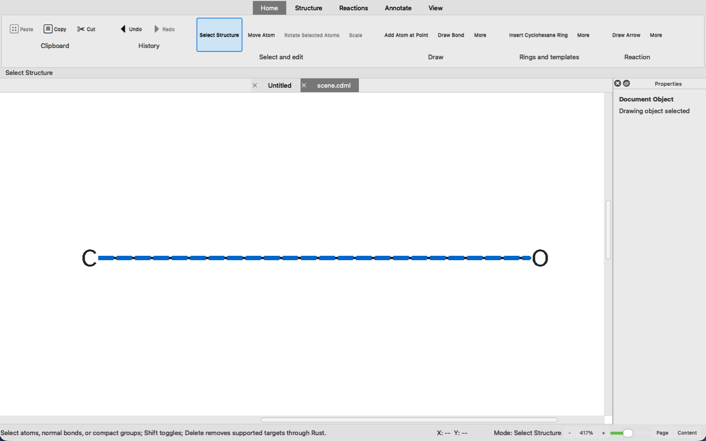

# One Accountable Owner for What the Reader Sees

A chemical drawing can be structurally correct and still make a reader hesitate. Today began with that small but consequential failure in [Ferrum Chemical Forge](https://github.com/vosslab/ferrum-chemical-forge): bonds could crowd the atom labels they were meant to meet cleanly. The useful question was not “how many pixels should this line move?” but “which layer can authoritatively decide where a reader-visible bond stops?” <!-- evidence: ev-6e846d246a8c430b -->

<!-- more -->

## The label is ink, not a convenient rectangle

A bond meets the painted label a reader sees, not an abstract atom symbol or a rough box around a glyph. Curved outlines, explicit hydrogen notation and counts, isotope marks, charges, masks, endpoint caps, stroke widths, and wedge overhang all change the visual space that must remain clear.

The sole-rightward-bond case made the distinction concrete. Hydrogen notation and its count can consume the apparent gap even when the core element glyph looks safely separated. The corrected construction moves explicit hydrogen and count left of the structural glyph in that case, while isotope and charge retain their conventional corners; exact run metrics then recompute the full decorated-label bounds. <!-- evidence: ev-6e846d246a8c430b -->

The architectural answer was to make Rust own the clearance plan. It now supplies exact directional glyph-outline support from the verified measurement font, decorated-label ink bounds, and bond-style endpoint footprints. Qt replays that established geometry rather than developing a second approximation of label avoidance. The layer that knows molecular topology and label construction makes the one decision that downstream drawing must honor. <!-- evidence: ev-6e846d246a8c430b -->

## One envelope for a parallel bond

Double and triple bonds are especially revealing because their lanes should read as one object. Allowing each lane to negotiate its own endpoint can produce individually plausible lines that tell an uncertain collective story at the label boundary.

Ferrum now treats the complete parallel terminal as one visual unit. Rust derives a bounded clearance envelope from its occupied final-ink interval, and every lane receives the same axial clips. The rule is deliberately durable: if a later depiction places parallel lanes asymmetrically, the terminal decision remains coherent rather than reopening a source of drifting endpoints. <!-- evidence: ev-6e846d246a8c430b -->

The result was measured in the real Qt path, not just accepted in a screenshot. Double-bond clearance increased from 1.92–2.70 pixels to 4.16–4.72 pixels, while strengthened synthetic, native, and Qt raster checks reported zero violations. That is satisfying for a specific reason: a subjective visual irritation became a concrete rendered property, tested across the direct and UI-backed paths that matter. <!-- evidence: ev-6e846d246a8c430b -->

Typography became part of the same geometry contract. Ferrum selected Atkinson Hyperlegible Next Regular 2.001 as its molecule-label default and vendored all 92 official font artifacts with licenses, immutable upstream revisions, byte lengths, and SHA-256 values. That provenance is not ornamental: glyph outlines determine measured ink, and measured ink determines safe bond clearance. An unversioned Rust `molecule_label()` role gives a future font substitution one accountable owner instead of requiring a cross-layer version protocol. <!-- evidence: ev-6e846d246a8c430b -->

## The same boundary appeared in other formats

In [the syllabus project](https://github.com/vosslab/syllabus), the analogous question was how a table can remain one readable editorial object across MkDocs, PDF, and DOCX. A shared Python calculator now reads visible headers and body cells, estimates wrap-aware demand, and supplies one set of proportions to all three rendering paths. The goal is not uniformity for its own sake: prose-heavy columns get room to remain readable, while short dates and labels stay compact. <!-- evidence: ev-6e5d733124d535e1 -->

The clearest reader-facing outcome is the seven monthly important-dates tables. Tables with matching headers share a width vector, so Date, Event, and Type retain alignment from month to month rather than becoming seven unrelated grids. The work was checked against rendered artifacts: all 26 tables were reviewed at desktop and mobile widths in light and dark themes, for 104 rendered states, alongside 1,315 fast tests, complete builds, and a browser audit. <!-- evidence: ev-6e5d733124d535e1 -->

In [Peptidyle Learning Engine](https://github.com/vosslab/peptidyle-learning-engine), the ownership boundary concerns historical assessment. A student’s past attempt cannot safely mean whatever editable course material exists today. Published questions, released assignments, fixed selections, issued questions, scoring facts, and reproduction evidence are being pinned to immutable revisions, while deterministic issued-question identities make retries return to the same assessment material. <!-- evidence: ev-3d099b09ae00cefb -->

The important safeguard is at the persistence boundary. PostgreSQL protections cover release immutability, membership, and scoring integrity where assessment evidence becomes durable. At the same time, student browser views remain answer-free and trusted reproduction details stay server-side; attempts to inject protected fields are rejected. Reproducibility without that confidentiality boundary would turn accountability into an answer-leakage path. <!-- evidence: ev-3d099b09ae00cefb -->

The smaller version of the lesson appeared in [the starter repository template](https://github.com/vosslab/starter-repo-template). GitHub Flavored Markdown is now its documentation baseline because GitHub is the target renderer and pipe tables are useful for ordinary tabular content. But the guide also names the boundary: captions and complex header associations are not semantics that GFM can express, so those cases require semantic HTML or a richer publishing path. The focused documentation and hygiene suite passed 535 checks, Pandoc rendered the guide with its GFM reader, and `git diff --check` passed. <!-- evidence: ev-dc19162c4dba16df -->

## Publishing only what survived

The publication pipeline in [vosslab-podcast](https://github.com/vosslab/vosslab-podcast) gave the same idea an operational form. Bundle v9’s `PublicationSurface` is now the active contract carrying selected survivor evidence, images, coverage, assets, admission information, and page-verification material. Bundle v8 remains historical evidence rather than a second definition of what the publisher must reconstruct. <!-- evidence: ev-1341b3a058d610bd -->

That boundary is behavioral rather than merely descriptive. Offline checks cover the route from `Stage6Input` through bundle construction and actual publisher seams, including the exclusion of an unselected aggregate screenshot from survivor assets. The system is learning that reproducibility does not require every transient pipeline state; it requires the bounded lineage that can explain, recover, and verify the result that was actually selected. <!-- evidence: ev-1341b3a058d610bd -->

The verification record also keeps imperfect outcomes visible. Permanent verification passed 3,728 producer tests, 1,462 publisher tests, and the controlled publisher E2E. A strict Python 3.13 build and controlled live run produced a degraded but auditable 10,474-byte publication, with recorded SHA-256 hashes for both its bundle and resulting page. A degraded result is not an ideal result, but bounded provenance makes it accountable rather than opaque. <!-- evidence: ev-1341b3a058d610bd -->

What connected the day was not centralization for its own sake. It was deciding which facts deserve one accountable owner: the visible clearance around a bond, the proportions of a recurring table, the material behind an issued assessment, and the evidence behind a published page.

The next tests are the untidy ones. Ferrum still needs ordinary editing with unfamiliar molecules, varied zoom states, platform font behavior, and accessibility interactions. The syllabus work needs pressure from denser course-specific schedules and may reveal where a documented human override is warranted. Peptidyle still needs staff-facing inspection that makes preserved evidence useful without exposing answers. The publication pipeline still has one historical phase required for terminal-receipt replay, leaving an open question about the smallest history that accountable recovery truly needs. <!-- evidence: ev-1341b3a058d610bd, ev-3d099b09ae00cefb, ev-6e5d733124d535e1, ev-6e846d246a8c430b -->

<!-- evidence: ev-1341b3a058d610bd, ev-3d099b09ae00cefb, ev-6e5d733124d535e1, ev-6e846d246a8c430b, ev-dc19162c4dba16df -->

## Project coverage

- [vosslab/syllabus](https://github.com/vosslab/syllabus) — 10 commits
- [vosslab/peptidyle-learning-engine](https://github.com/vosslab/peptidyle-learning-engine) — 8 commits
- [vosslab/vosslab-podcast](https://github.com/vosslab/vosslab-podcast) — 4 commits
- [vosslab/ferrum-chemical-forge](https://github.com/vosslab/ferrum-chemical-forge) — 3 commits
- [vosslab/starter-repo-template](https://github.com/vosslab/starter-repo-template) — 1 commit
